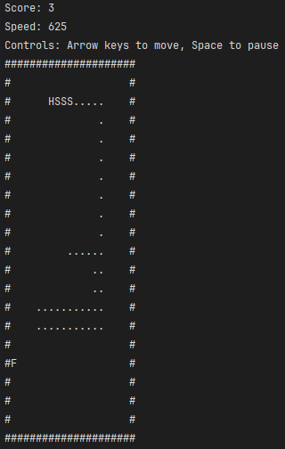

# Snake Game

Простая игра "Змейка", реализованная на C#.

## Управление

- **Стрелка влево** ← - Движение влево
- **Стрелка вправо** → - Движение вправо
- **Стрелка вверх** ↑ - Движение вверх
- **Стрелка вниз** ↓ - Движение вниз
- **Пробел** - Пауза/продолжение игры

## Игровой процесс

*Основной игровой процесс - змейка собирает еду*